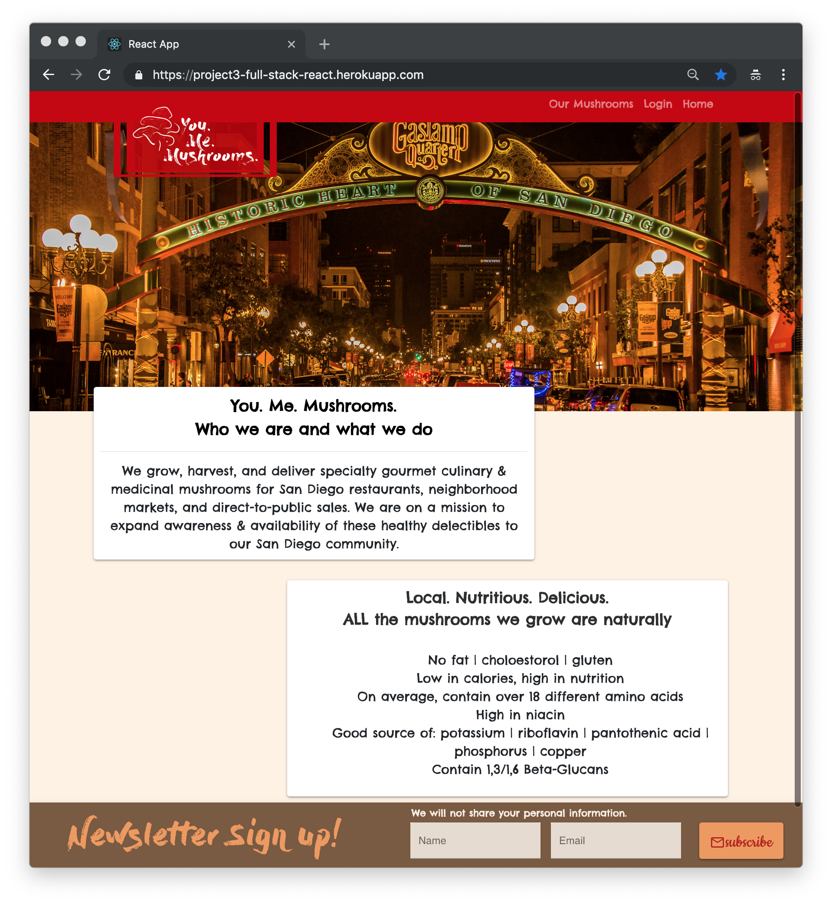
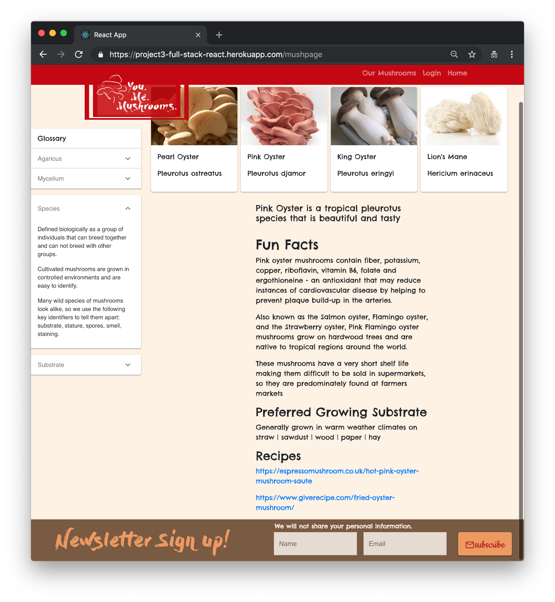
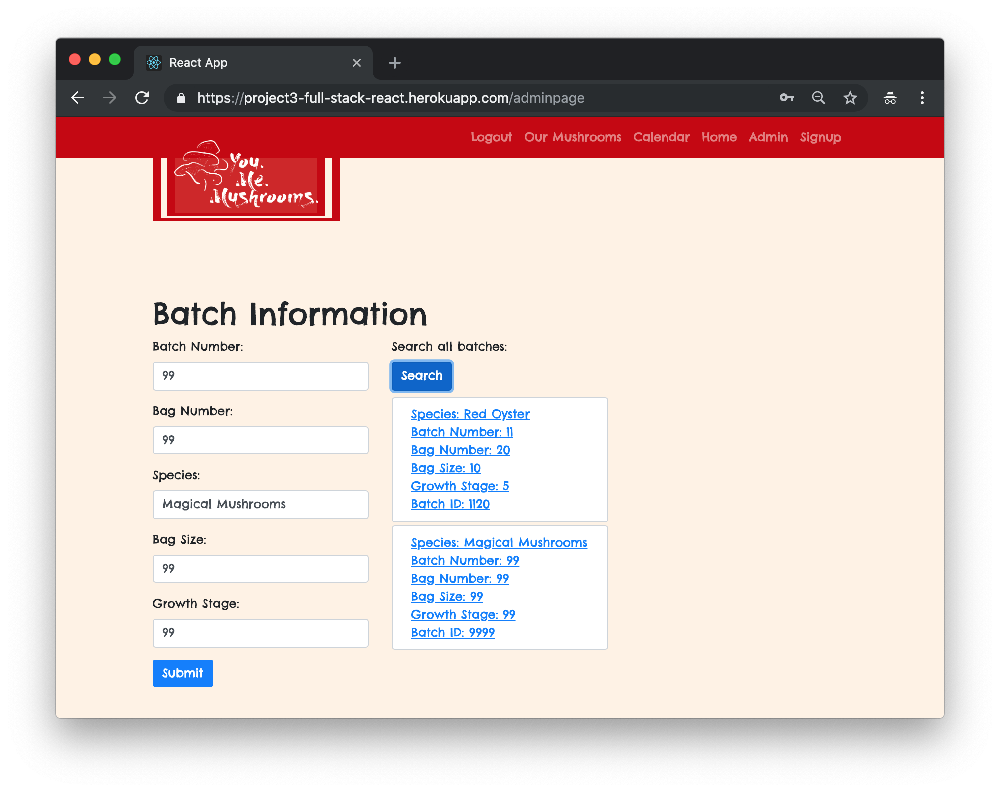
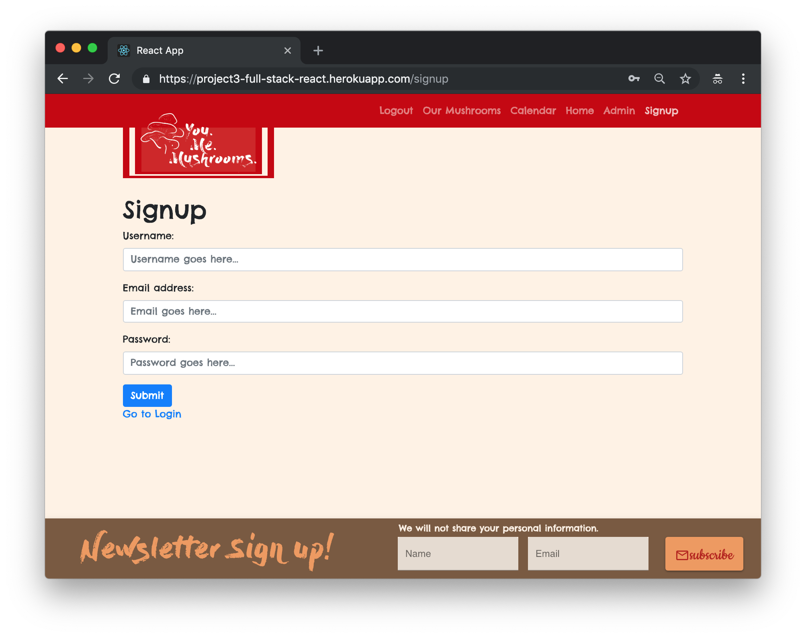

# &#35; You Me Mushrooms&nbsp;&nbsp;

## Description
We grow, harvest, and deliver specialty gourmet culinary & medicinal mushrooms for San Diego restaurants, neighborhood markets, and direct-to-public sales. We are on a mission to expand awareness & availability of these healthy delectables to our San Diego community.

## Getting Started
Try the Application Here: [https://project3-full-stack-react.herokuapp.com/) (`Heroku`)

## The Screenshots

`Welcome to You Me Mushrooms!`&#8673;

`Here are some Fun Facts!`&#8673;

`Administrators can Create, Read, Update and Delete!`&#8673;

`Signup to see what's growing!`&#8673;

## You Me Mushroom Pages
* Homepage
* Our Mushrooms
* User Signup
* User/Member Login
* Species Grow Calendar
* An Administrator Profile
* What's Currently Growing?

## Technologies Utilized
* [Visual Studio Code](https://code.visualstudio.com/)
* [React.js](https://reactjs.org)
* [Node.js](https://nodejs.org/en)
* [Robo 3T](https://robomongo.org)
* [MongoDB](https://www.mongodb.com)
* [Mongoose/MongoDB](https://mongoosejs.com)
* [Axios](https://www.npmjs.com/package/axios)
* [JSON Web Token](https://www.npmjs.com/package/jsonwebtoken)
* [Express](https://www.npmjs.com/package/express)
* [Morgan](https://www.npmjs.com/package/morgan/v/1.1.1)
* [React Event Listener](https://www.npmjs.com/package/react-event-listener)
* [Postman](https://www.getpostman.com)
* [Google Material-UI](https://material-ui.com)
* [Model-View-Controller Paradigm](https://www.tutorialspoint.com/mvc_framework/mvc_framework_introduction.htm)
* [Heroku](https://www.heroku.com)
* [mLab MongoDB](https://elements.heroku.com/addons/mongolab)
* [JavaScript/ES6](http://es6-features.org/#Constants)
* [JSX](https://reactjs.org/docs/introducing-jsx.html)
* [Yarn Dependencies MGMT](https://yarnpkg.com/en)
* [Node Dependencies](https://nodejs.org/en)
* [jQuery](https://jquery.com/download)
* [Bootstrap 4](https://getbootstrap.com)
* [CSS3](https://developer.mozilla.org/en-US/docs/Web/CSS/CSS3)
* [Google Fonts](https://fonts.google.com)
* [GitHub](https://github.com)
* [PowerShell](https://docs.microsoft.com/en-us/powershell/scripting/overview?view=powershell-6)
* [Bash GNU](https://www.gnu.org/software/bash)
* [Google Chrome](https://www.google.com/chrome)
* [Adobe Photoshop CC 2018](https://www.google.com/chrome)

## About the Authors:
* [Frank 'Frank' Donnelly](https://github.com/FSDonnelly)
* [Emily 'Em' Goss](https://github.com/SanDiegoEMG)
* [Isao 'Agustin' Chavez](https://github.com/isao92)
* [ShihYung 'Star' Hsu](https://github.com/star104)
* [Katherine 'Kat1' J. Bell](https://github.com/katbytes)
